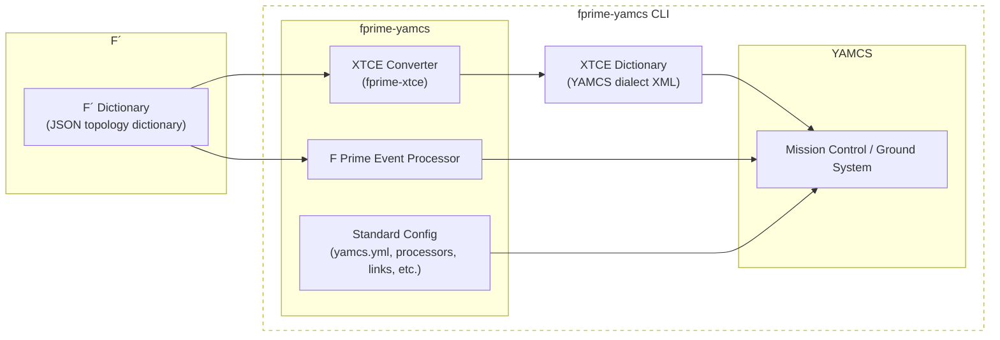

# fprime-yamcs: A YAMCS to F Prime Bridge Package

fprime-yamcs is designed to run YAMCS as the ground system when working with fprime. It operates similar to fprime-gds where it launches YAMCS in-lieu of the fprime-gds data pipelines.

## Requirements

`fprime-yamcs` requires the users to have `mvn` installed. See: [https://maven.apache.org/](https://maven.apache.org/).

> [!CAUTION]
> `mvn` requires JDK to be installed

## Usage

Install this package and run `fprime-yamcs` on a compatible F Prime deployment.

## Configuration 

YAMCS is powerful and has many configuration properties. `fprime-yamcs` requires one instance of YAMCS defined in the configuration to have the following MDB:

```
mdb:
   - type: xtce
     args:
        file: .../fprime.xtce.xml
```

This is to allow for automatic dictionary generation. Users declining this service must specify: `--no-convert-dictionary`.

## Caveats

Currently, the default configuration of YAMCS requires F Prime to connect a CCSDS TC/TM framer/deframer to the Drv.Udp component ensuring that UDP is the transport mechanism.


