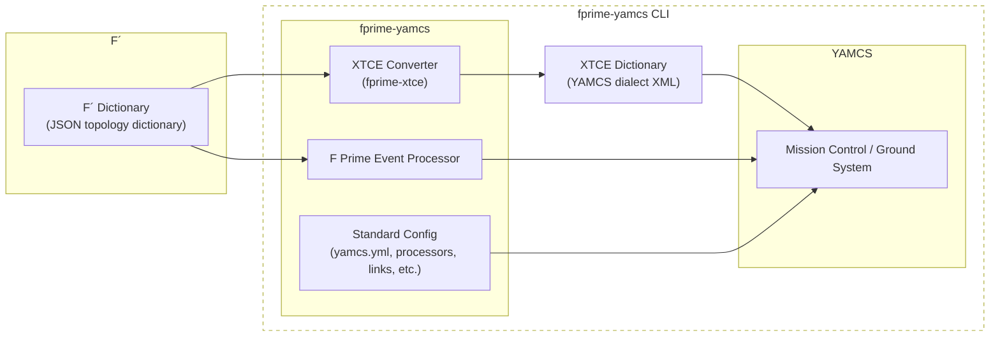

# fprime-yamcs: A YAMCS to F Prime Bridge Package

fprime-yamcs is designed to run YAMCS as the ground system when working with fprime. It operates similar to fprime-gds where it launches YAMCS in-lieu of the fprime-gds data pipelines.

## Requirements

`fprime-yamcs` requires the users to have `mvn` installed. See: [https://maven.apache.org/](https://maven.apache.org/).

> [!CAUTION]
> `mvn` requires JDK to be installed

## Usage

Install this package and run `fprime-yamcs` on a compatible F Prime deployment.

## fprime-yamcs-comm: Communication Bridge

`fprime-yamcs-comm` bridges bidirectional communication between an F Prime endpoint and the YAMCS UDP intake/outlet:

- The endpoint side is reached through an F Prime GDS **communication adapter plugin** (`--communication-selection`: `uart`, `ip`, or any installed adapter plugin).
- The YAMCS side pushes deframed packets as UDP datagrams to the telemetry intake (`--tm-host`/`--tm-port`) and receives command datagrams on a local UDP port (`--tc-host`/`--tc-port`).
- One stage of framing/deframing sits in between, provided by an F Prime GDS **framing plugin** (`--framing-selection`). The default is the packaged `no-op` framer/deframer, which passes data through unchanged since YAMCS nominally performs framing/deframing itself. Select `fprime` to apply the standard F Prime framing (start word, length, data, checksum) on the endpoint side.

Example, bridging a UART device to YAMCS with no additional framing:

```
fprime-yamcs-comm --communication-selection uart --uart-device /dev/ttyUSB0 --uart-baud 115200 \
    --tm-host 127.0.0.1 --tm-port 50000 --tc-port 50001
```

## Configuration 

YAMCS is powerful and has many configuration properties. `fprime-yamcs` requires one instance of YAMCS defined in the configuration to have the following MDB:

```
mdb:
   - type: xtce
     args:
        file: .../fprime.xtce.xml
```

This is to allow for automatic dictionary generation. Users declining this service must specify: `--no-convert-dictionary`.

## Caveats

Currently, the default configuration of YAMCS requires F Prime to connect a CCSDS TC/TM framer/deframer to the Drv.Udp component ensuring that UDP is the transport mechanism.


```mermaid id="th4eai"
flowchart LR
    subgraph FPRIME["F´"]
        FPD["F´ Dictionary<br/>(JSON topology dictionary)"]
    end

    subgraph OUTER["fprime-yamcs CLI"]
        subgraph FY["fprime-yamcs"]
            XTCEC["XTCE Converter<br/>(fprime-xtce)"]
            EVENTS["F Prime Event Processor"]
            BASECFG["Standard Config<br/>(yamcs.yml, processors, links, etc.)"]
        end

        XTCE["XTCE Dictionary<br/>(YAMCS dialect XML)"]

        subgraph YSYS["YAMCS"]
            YAMCS["Mission Control / Ground System"]
        end
    end

    FPD --> XTCEC
    FPD --> EVENTS

    XTCEC --> XTCE
    XTCE --> YAMCS
    EVENTS --> YAMCS
    BASECFG --> YAMCS

    %% Make the outer box dotted with no background
    style OUTER stroke-dasharray: 5 5, fill:none
```
