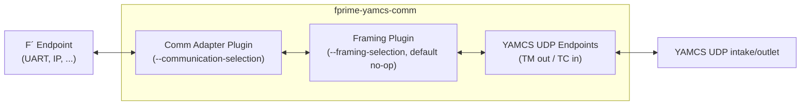
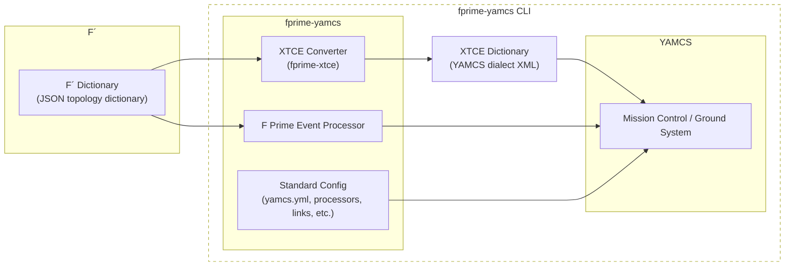

# fprime-yamcs: A YAMCS to F Prime Bridge Package

fprime-yamcs is designed to run YAMCS as the ground system when working with fprime. It operates similar to fprime-gds where it launches YAMCS in-lieu of the fprime-gds data pipelines.

## Requirements

`fprime-yamcs` is pip-only: `pip install fprime-yamcs` brings in everything needed to run,
including the YAMCS jars (`fprime-yamcs-bundle`, AGPL-3.0) and a trimmed Java runtime
(`fprime-yamcs-runtime`, GPL-2.0 with Classpath Exception). Neither Maven nor a system JDK is
required.

The launcher resolves Java in this order: `JAVA_HOME`, then `java` on the `PATH`, then the
pip-provided runtime — using the first candidate that is Java 17 or newer.

The `fprime-yamcs-runtime` wheel is published for Linux (x86_64, arm64), macOS (x86_64,
arm64), and Windows (x86_64), and installs automatically on those platforms via environment
markers. On other platforms it is skipped: `pip install fprime-yamcs` still succeeds, and a
system Java 17+ must be provided (set `JAVA_HOME` or add `java` to the `PATH`).

> [!NOTE]
> Developers working from a source checkout (rather than a released wheel) still need `mvn`
> and a JDK 17+ to build the jars: run `./scripts/build-jars.sh` once, or let the launcher
> fall back to `mvn yamcs:run`. The Maven fallback does not support `--yamcs-plugin-jars`
> and does not load entry-point discovered plugin jars.

## Usage

Install this package and run `fprime-yamcs` on a compatible F Prime deployment.

## fprime-yamcs-events: Event Processor

`fprime-yamcs-events` runs the F Prime event processor standalone: it reads the F Prime JSON topology dictionary and publishes F Prime events into YAMCS. It is launched automatically by `fprime-yamcs`; run it directly when operating YAMCS without the full `fprime-yamcs` launcher.

### F´ Events Web Display

The YAMCS web interface gains an **F´ Events** page (sidebar item, served at `/ext/fprime-events`) providing the event display F Prime developers know from `fprime-gds`:

- Whole-row colors by F Prime severity (FATAL, WARNING_HI, WARNING_LO, ACTIVITY_HI, ACTIVITY_LO, COMMAND, DIAGNOSTIC), using a color-blind-safe palette derived from Okabe-Ito.
- Filtering by event ID (hex or decimal), event name, message text, severity (per-severity toggles), and time range.
- A virtualized table (only on-screen rows are rendered) with infinite scroll-back into the YAMCS event archive, plus a "Follow latest" toggle that keeps the view pinned to the newest event.

This works because the event processor publishes each event with structured `extra` fields (`fprime_severity`, `fprime_event_id`, `fprime_event_name`) preserving the full 7-level F Prime severity set, which YAMCS's native 5-level severity model cannot represent. The page is registered by the `FprimeEventsWebExtension` YAMCS plugin bundled with the YAMCS project that `fprime-yamcs` builds; no additional configuration is required. Events published by older versions of the event processor (without the `extra` fields) are shown with a best-effort severity derived from the YAMCS severity.

## fprime-yamcs-tlmchan: Telemetry Channel Splitter

`Svc.TlmChan` packs multiple (id, time, value) telemetry channel records into a single downlinked packet, but the generated XTCE models one channel per packet keyed on the first channel id — so YAMCS alone only decodes the first record of each packet.

`fprime-yamcs-tlmchan` closes this gap: it reads the F Prime JSON topology dictionary, subscribes to the aggregate `FPrimeTelemetryChannel` container, walks every record in each packet, and re-injects each record beyond the first as a standalone single-record space packet on a dedicated UDP telemetry data link (`UDP_TM_SPLIT_IN`, default port 50002, configurable via `--udp-tm-inject-port` / `FPRIME_YAMCS_TM_INJECT_PORT`). YAMCS then decodes each injected packet through its normal XTCE path, publishing every channel as a parameter. It is launched automatically by `fprime-yamcs`; run it directly when operating YAMCS without the full `fprime-yamcs` launcher.

## fprime-yamcs-comm: Communication Bridge

`fprime-yamcs-comm` bridges bidirectional communication between an F Prime endpoint and the YAMCS UDP intake/outlet:

- The endpoint side is reached through an F Prime GDS **communication adapter plugin** (`--communication-selection`: `uart`, `ip`, or any installed adapter plugin).
- The YAMCS side pushes deframed packets as UDP datagrams to the telemetry intake (`--tm-host`/`--tm-port`, default `127.0.0.1:50000`) and receives command datagrams on a local UDP port (`--tc-host`/`--tc-port`, default `127.0.0.1:50001`). Command datagrams are only accepted from the TM host, loopback (`127.0.0.1`), and any hosts supplied via `--tc-allowed-source`; hostnames are resolved to IPv4 addresses once at startup and compared against the datagram source IP.
- One stage of framing/deframing sits in between, provided by an F Prime GDS **framing plugin** (`--framing-selection`). The default is the packaged `no-op` framer/deframer, which passes data through unchanged since YAMCS nominally performs framing/deframing itself. Select `fprime` to apply the standard F Prime framing (start word, length, data, checksum) on the endpoint side.

> [!NOTE]
> The UDP-transport requirement described under [Caveats](#caveats) applies to connecting F Prime directly to YAMCS; `fprime-yamcs-comm` lifts it by bridging non-UDP endpoints (e.g. UART) to the YAMCS UDP links.

> [!WARNING]
> With `no-op` framing over a stream-oriented adapter (`uart`, `ip`), packet boundaries depend on read timing: packets may be split or merged across UDP datagrams. Use a boundary-recovering framing plugin (e.g. `--framing-selection fprime`) unless the endpoint stream carries self-delimiting data that YAMCS deframes. The bridge warns on startup for the built-in stream adapters only; third-party stream adapters are not detected.

Operational notes: the bridge exits with a non-zero code if either data pump fails abnormally, so supervisors can detect and restart it; buffered downlink data that the framing plugin cannot deframe is discarded (with a warning) once it exceeds ten maximum-size datagrams (~640 KB).

Example, bridging a UART device to YAMCS with F Prime framing recovering packet boundaries (all UDP flags shown use their default values):

```
fprime-yamcs-comm --communication-selection uart --uart-device /dev/ttyUSB0 --uart-baud 115200 \
    --framing-selection fprime --tm-host 127.0.0.1 --tm-port 50000 --tc-port 50001
```


```mermaid
flowchart LR
    subgraph COMM["fprime-yamcs-comm"]
        ADPT["Comm Adapter Plugin<br/>(--communication-selection)"]
        FRAME["Framing Plugin<br/>(--framing-selection, default no-op)"]
        UDP["YAMCS UDP Endpoints<br/>(TM out / TC in)"]
        ADPT <--> FRAME
        FRAME <--> UDP
    end
    EP["F´ Endpoint<br/>(UART, IP, ...)"] <--> ADPT
    UDP <--> YAMCS["YAMCS UDP intake/outlet"]
```

### Testing

The bridge's integration tests (`tests/test_comm_bridge.py`) require `socat` to emulate a UART endpoint; without it only the unit tests run (the integration tests are skipped). CI environments running these tests should install `socat`.

## Configuration 

YAMCS is powerful and has many configuration properties. `fprime-yamcs` requires one instance of YAMCS defined in the configuration to have the following MDB:

```
mdb:
   - type: xtce
     args:
        file: .../fprime.xtce.xml
```

This is to allow for automatic dictionary generation. Users declining this service must specify: `--no-convert-dictionary`.

## Web Extensions

Projects may extend the YAMCS web interface with their own JavaScript:

```sh
fprime-yamcs --yamcs-web-extension-dirs path/to/extension-dir ...
```

Every top-level `.js` file in each directory is loaded as a module script by
the YAMCS web interface, and the directory's files are served alongside the
webapp's static files. Paths must not contain commas or whitespace.

Extensions may also be shipped as pip packages: include the extension directory as package
data and advertise it through a `fprime_yamcs.web_extensions` entry point resolving to the
directory path (a `str`/`Path`, an iterable of them, or a zero-argument callable returning
either). Installed extensions are discovered automatically — no flags required:

```toml
[project.entry-points."fprime_yamcs.web_extensions"]
my_extension = "my_package:WEB_EXTENSION_DIR"
```

## YAMCS Plugins

Projects with their own Java YAMCS plugins can add jars to the YAMCS classpath:

```sh
fprime-yamcs --yamcs-plugin-jars path/to/plugin.jar path/to/jar-dir ...
```

Plugin jars may also be shipped as pip packages: build the jar in CI (the reusable
[`build-yamcs-plugin.yml`](.github/workflows/build-yamcs-plugin.yml) workflow does this),
include it as package data, and advertise it through a `fprime_yamcs.plugin_jars` entry point
resolving to the jar (or a directory of jars). Installed plugin jars are discovered
automatically. On the classpath, the YAMCS jars come first, then the fprime-yamcs plugin
jar, then entry-point discovered jars, then `--yamcs-plugin-jars` values:

```toml
[project.entry-points."fprime_yamcs.plugin_jars"]
my_plugin = "my_package:PLUGIN_JAR"
```

## Packages and Licensing

| Package | Contents | License |
| --- | --- | --- |
| `fprime-yamcs` | Python code + the fprime-yamcs YAMCS plugin jar | Apache-2.0 |
| `fprime-yamcs-bundle` | YAMCS and its dependency jars | AGPL-3.0 |
| `fprime-yamcs-runtime` | jlink-trimmed Eclipse Temurin Java runtime | GPL-2.0 with Classpath Exception |

## Caveats

Currently, the default configuration of YAMCS requires F Prime to connect a CCSDS TC/TM framer/deframer to the Drv.Udp component ensuring that UDP is the transport mechanism.


```mermaid id="th4eai"
flowchart LR
    subgraph FPRIME["F´"]
        FPD["F´ Dictionary<br/>(JSON topology dictionary)"]
    end

    subgraph OUTER["fprime-yamcs CLI"]
        subgraph FY["fprime-yamcs"]
            XTCEC["XTCE Converter<br/>(fprime-xtce)"]
            EVENTS["F Prime Event Processor"]
            BASECFG["Standard Config<br/>(yamcs.yml, processors, links, etc.)"]
        end

        XTCE["XTCE Dictionary<br/>(YAMCS dialect XML)"]

        subgraph YSYS["YAMCS"]
            YAMCS["Mission Control / Ground System"]
        end
    end

    FPD --> XTCEC
    FPD --> EVENTS

    XTCEC --> XTCE
    XTCE --> YAMCS
    EVENTS --> YAMCS
    BASECFG --> YAMCS

    %% Make the outer box dotted with no background
    style OUTER stroke-dasharray: 5 5, fill:none
```
